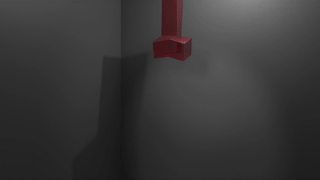
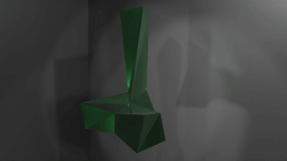
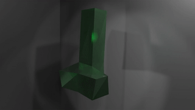

# FEPR: Fast Energy Projection for Real-Time Simulation of Deformable Objects using Taichi

Implementation of [FEPR: Fast Energy Projection for Real-Time Simulation of Deformable
Objects](https://www.cs.utah.edu/~ladislav/dinev18FEPR/dinev18FEPR.pdf) using the [Taichi](https://taichi.readthedocs.io/en/stable/install.html) Framework.




## Run
**Important:** Open blender in the root of the repository using command line (**not** in `src`), otherwise Blender will not find the required files. 
- In blender, create a new scene and delete the default Cube
- Click on the Scripting Tab and open `src/blender_visualization.py`. See [Section on Parameters](#params) for an explanation of the parameters
- **Run the Simulation** clicking on the `play` button and run the Simulation by pressing the space bar when in Animation Mode

### Running without Blender
Our code is intended and tested for running with Blender, using Taichi Blend.

If you want to run the code without Blender, you have to replace the `main` Function in `src/blender_visualization.py` to use your desired visualization framework and then run the file from the console. You might also have to remove imports such as `numblend`.

---
## <a name="params"></a> Parameters
All parameters for the visualization are provided in the `main` Function in `src/blender_visualization.py`:

```python
meshObj = taichi_mesh.MeshObject(FEPR=True, dt=0.033, node_mass=5, E=1e3, nu=0.3, demo=1, filename="ellell.1", damping=0.999, ground_height=ground_height, iterations_per_frame=1, G=9.81)
```

Relevant Parameters:
- `FEPR`: Indicates if FEPR should be enabled or not
- `dt`: the timestep
- `Node Mass`: Mass of a single node.
- `E`: Young's Modulus
- `nu`: Poisson's ratio (in [0, 0.5)), used to compute Lamé parameters
- `Demo`: Which demo to run (different types of deformations)
- `filename`: Name of your tetrahedral meshes. Check [the next Section](#meshes) for instructions of how to create your own meshes
- `damping`: damping parameter for the update step
- `ground_height`: not currently used. Sets the height of the ground plane to allow collision support
- `iterations_per_frame`: how many iterations per frame, all demos are created using 1
- `G`: Gravity, not currently used


---
## <a name=meshes></a> Creating new Meshes
We use Tetrahedron discretization for our simulation.
- To create different models for Visualization, you can use [tetgen](http://wias-berlin.de/software/tetgen/download2.jsp), that we also provide in this repository.
- Open a terminal in the `path_to_project/tetgen` \
    (e.g. a `.poly` file, check the documentation for which file types are supported)
- Run `tetgen -Rz example.poly`
- This will create 3 different files (`.ele`, `.node`, `.face`)
- Now replace the `filename` in `src/blender_visualization.py` with the corresponding filename

**Important:** Taichi only supports meshes of up to 1024 nodes. So currently, the code only supports very small meshes (the `cube` and `ellell` provided are small enough).


---

## Requirements
- To run the simulation in blender, [Taichi-Blend](https://github.com/taichi-dev/taichi_blend) is required.
- If you use Blender for the Simulation, it will handle all other imports for you
- If you want to run independent of Blender, make sure to install the requirements in `requirements.txt`

---
## <a name=demos></a> Demos


*Without FEPR*


*Using FEPR*


All demos can be found in the `demos/` subfolder.

### Demo 1 (Wobbly fall)
`demos/demo1/not_using_fepr.mp4` timestep=1/20s, exploding, not using FEPR 
`demos/demo1/using_fepr.mp4` timestep=1/20s, stable, using FEPR

### Demo 2 (T pose test mesh)
`demos/demo2/not_using_fepr.mp4` timestep=1/45s, almost exploding, unnatural movement, not using FEPR
`demos/demo2/using_fepr.mp4` timestep=1/30s, not exploding, damped movement, using FEPR

### Demo 3 (Movement due to initial scaling)
`demos/demo3/not_using_fepr.mp4` timestep=1/30, exploding, not using FEPR
`demos/demo3/using_fepr.mp4` timestep=1/30, stable movement, using FEPR

### Demo 4
Does not load due to taichi limitations (See issues documented along)


---
## References
- FEPR Paper: https://www.cs.utah.edu/~ladislav/dinev18FEPR/dinev18FEPR.pdf
- Lecture Slides of [Physically-Based Simulations 2021](https://cgl.ethz.ch/teaching/simulation21/home.php)
- Blog [Elasticity, Finite Element Method and Advanced Taichi techniques (Lec 03)](https://dongqing-wang.com/blog/games201l3/) of Dongqing Wang
- First derivative: https://taichi.readthedocs.io/en/stable/differentiable_programming.html
- Warning for large Vector/Matrix fields: https://github.com/taichi-dev/taichi/issues/2696#issue-971309657
- Issue maximum Number of nodes with gradient: https://github.com/taichi-dev/taichi/blob/ec413c4ea1ed74c4d28fb9a9599f2d85cd164312/taichi/struct/struct_llvm.cpp#L307
- Issue maximum Number of nodes with gradient: https://github.com/taichi-dev/taichi/blob/ec413c4ea1ed74c4d28fb9a9599f2d85cd164312/taichi/inc/constants.h#L12

- Issue no second derivative: https://github.com/taichi-dev/taichi/issues/385


